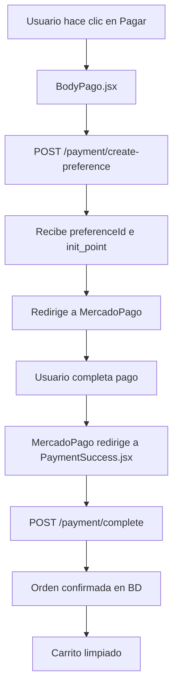

# 🛒 Integración de Carrito de Compras con MercadoPago - COMPLETA

## 🎯 OBJETIVO
Integrar completamente el sistema de carrito de compras con MercadoPago usando los nuevos endpoints del backend que ya está funcionando en `cinesnacksapi.chuy7x.space:3002`.

## 📡 ENDPOINTS DISPONIBLES (YA FUNCIONANDO)

### Crear Preferencia de Pago
```javascript
POST /payment/create-preference
Headers: { 
  'Authorization': 'Bearer ' + userToken,
  'Content-Type': 'application/json' 
}
Body: { user_id: number }
Response: { preferenceId: string, init_point: string }
```

### Completar Pago
```javascript
POST /payment/complete  
Headers: { 
  'Authorization': 'Bearer ' + userToken,
  'Content-Type': 'application/json' 
}
Body: { 
  user_id: number, 
  payment_id: string, 
  status: string, 
  merchant_order_id: string 
}
Response: { success: boolean, orderId: string }
```

## 🛠️ ARCHIVOS A ACTUALIZAR

### 1. BodyPago.jsx - Componente Principal

```javascript
const handlePayment = async () => {
  try {
    const token = localStorage.getItem('token');
    const userId = getUserIdFromToken(); // Tu función existente
    
    const response = await fetch('/payment/create-preference', {
      method: 'POST',
      headers: {
        'Authorization': `Bearer ${token}`,
        'Content-Type': 'application/json'
      },
      body: JSON.stringify({ user_id: userId })
    });

    const data = await response.json();
    
    if (data.success && data.data) {
      // Redirigir a MercadoPago
      window.location.href = data.data.init_point;
    }
  } catch (error) {
    console.error('Error:', error);
  }
};
```

### 2. PaymentSuccess.jsx - Página de Éxito

```javascript
useEffect(() => {
  const urlParams = new URLSearchParams(window.location.search);
  const paymentId = urlParams.get('payment_id');
  const status = urlParams.get('status');
  const merchantOrderId = urlParams.get('merchant_order_id');

  if (paymentId && status === 'approved') {
    completePayment(paymentId, status, merchantOrderId);
  }
}, []);

const completePayment = async (paymentId, status, merchantOrderId) => {
  try {
    const token = localStorage.getItem('token');
    const userId = getUserIdFromToken();
    
    const response = await fetch('/payment/complete', {
      method: 'POST',
      headers: {
        'Authorization': `Bearer ${token}`,
        'Content-Type': 'application/json'
      },
      body: JSON.stringify({ 
        user_id: userId, 
        payment_id: paymentId, 
        status: status, 
        merchant_order_id: merchantOrderId 
      })
    });

    const result = await response.json();
    if (result.success) {
      // Mostrar mensaje de éxito
      // Limpiar carrito local si tienes
      // Redirigir a historial de órdenes
    }
  } catch (error) {
    console.error('Error completing payment:', error);
  }
};
```

## 🔧 CONFIGURACIÓN NECESARIA

### apiConfig.js
```javascript
const API_BASE_URL = 'https://cinesnacksapi.chuy7x.space:3002';
// O si estás en desarrollo local: 'http://localhost:3002'
```

### Rutas de Retorno de MercadoPago
El backend ya está configurado para redirigir a:
- ✅ **Éxito**: `https://cinesnacks.chuy7x.space/payment-success`
- ❌ **Fallo**: `https://cinesnacks.chuy7x.space/payment-failure`
- ⏸️ **Pendiente**: `https://cinesnacks.chuy7x.space/payment-pending`

## 🚀 PASOS DE IMPLEMENTACIÓN

1. **Actualizar BodyPago.jsx** con el nuevo endpoint `api/v1/payment/create-preference`
2. **Actualizar PaymentSuccess.jsx** con el endpoint `api/v1/payment/complete`  
3. **Verificar apiConfig.js** apunte al servidor correcto
4. **Probar flujo completo**: Agregar productos → Carrito → Pagar → Confirmar

## ✅ VALIDACIONES IMPORTANTES

- ✅ Usuario debe tener items en el carrito
- ✅ Token de autenticación válido en localStorage
- ✅ UserId debe extraerse correctamente del token
- ✅ Manejar errores de red y respuestas del servidor

## 🔍 DEBUGGING

Si hay errores, revisar:
1. **Console del navegador** para errores JS
2. **Network tab** para ver requests/responses
3. **Token de autorización** en localStorage
4. **Formato correcto** de los payloads JSON

## 🎯 FLUJO COMPLETO



## 📊 ESTADO ACTUAL DEL BACKEND

**✅ BACKEND STATUS: COMPLETAMENTE FUNCIONAL**
- ✅ Servidor corriendo en puerto 3002
- ✅ PaymentService con MercadoPago configurado
- ✅ Endpoints de pago disponibles y autenticados
- ✅ Base de datos conectada
- ✅ Logs detallados para debugging
- ✅ Tokens de MercadoPago correctamente configurados

**🔄 FRONTEND STATUS: PENDIENTE DE ACTUALIZACIÓN**
- 🔄 Necesita actualizar componentes para usar nuevos endpoints
- 🔄 Configurar URLs correctas del API
- 🔄 Implementar manejo de respuestas de MercadoPago

---

## 📝 NOTAS TÉCNICAS

### Estructura de Respuesta de MercadoPago
Cuando MercadoPago redirige después del pago, incluye estos parámetros en la URL:
- `payment_id`: ID único del pago
- `status`: estado del pago (approved/rejected/pending)
- `merchant_order_id`: ID de la orden en MercadoPago

### Headers Requeridos
Todos los endpoints requieren:
- `Authorization: Bearer {token}`
- `Content-Type: application/json`

### URLs Base
- **Producción**: `https://cinesnacksapi.chuy7x.space:3002`
- **Desarrollo**: `http://localhost:3002`

---

## 🚨 CORRECCIÓN CRÍTICA DETECTADA

**PROBLEMA IDENTIFICADO**: El frontend está enviando `user_id` correctamente, pero hay un problema en la respuesta. El backend devuelve:
```json
{
  "success": true,
  "data": {
    "preferenceId": "...",
    "init_point": "..."
  }
}
```

**CORRECCIÓN EN EL FRONTEND**: Cambiar de `data.preferenceId` a `data.data.init_point`:

```javascript
// ❌ INCORRECTO
if (data.preferenceId) {
  window.location.href = data.init_point;
}

// ✅ CORRECTO  
if (data.success && data.data) {
  window.location.href = data.data.init_point;
}
```

---

**El backend está 100% funcional y esperando las requests del frontend.**